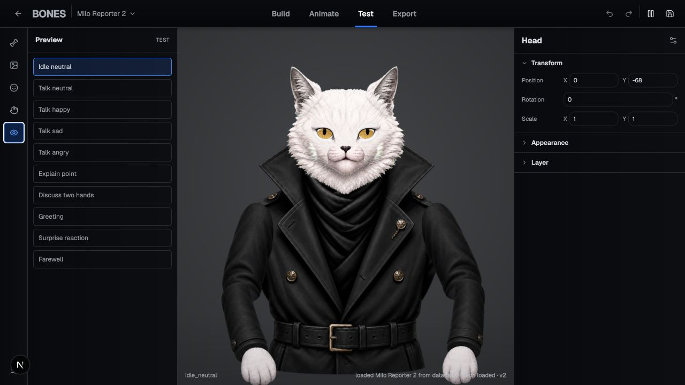
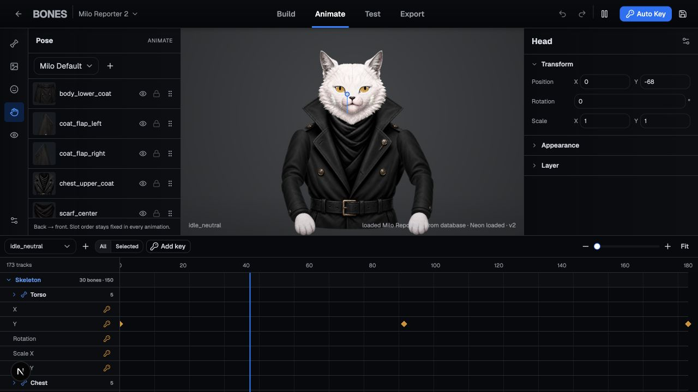
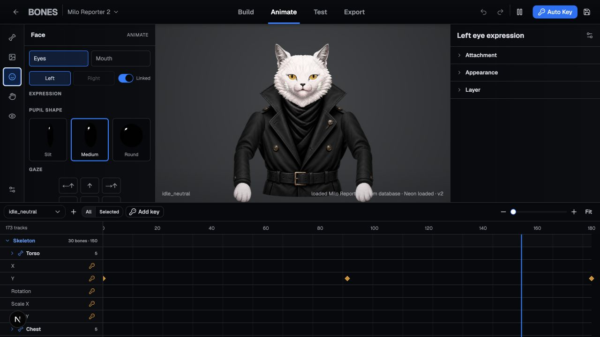
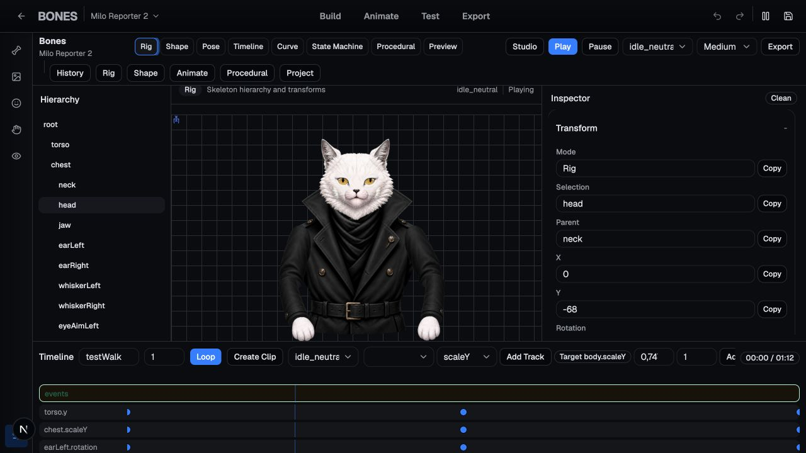

# Bones

**A web-native visual rigging and animation studio for expressive 2D characters in PixiJS 8.**

Bones turns layered artwork, vector shapes, animation data, and gameplay parameters into a versioned source project and a compact runtime asset. It combines a browser editor, a deterministic compiler, and a standalone PixiJS runtime—without requiring a paid animation runtime in the shipped game.



## Why Bones

- **One workflow from artwork to runtime.** Build a skeleton, bind visual parts, author poses and clips, tune transitions, test the character, and export runtime JSON from the same project.
- **Built specifically for the web.** The editor uses React, Next.js, and PixiJS 8; the game runtime is a separate TypeScript/PixiJS library with no React, Next.js, or DOM dependency.
- **No opaque binary project format.** Source projects are versioned JSON that can be validated, migrated, reviewed, diffed, and stored in Git.
- **Compact shipping data.** The compiler removes editor-only metadata, flattens transforms and keyframes, prepares lookups, and reports compressed and uncompressed export sizes against a 200 KiB runtime-data target.
- **Deep animation authoring.** Bones includes a dopesheet, graph curves, reusable poses, crossfades, additive and masked layers, 1D blend trees, animation events, markers, and visual state-machine editing.
- **Character-facing controls.** Skins, attachment slots, mesh weights and deformation, draw order, eye expressions, pupil shapes, gaze, mouth shapes, and facial animation tracks are part of the editor model.
- **Platformer-aware preview.** The preview stack understands locomotion parameters, collision helpers, moving platforms, wall surfaces, camera zones, death zones, and LDtk test rooms without turning Bones into a level editor.
- **Runtime motion beyond keyframes.** Breathing, squash/stretch, secondary motion, landing impact, crossfades, state transitions, and a soft Foot IK constraint pass are available to the runtime.
- **Mobile-conscious rendering.** Low, medium, and high quality presets control resolution, antialiasing, secondary motion, cloth update frequency, and dynamic-mesh limits.
- **Persistence with recovery paths.** Local drafts work in the browser; optional PostgreSQL/Neon persistence adds a project library, optimistic version checks, revisions, restore, and asset metadata.

## Interface tour

### Project library and character templates

Open existing characters, import a source project, or start from a human, animal, reporter, or blank rig.


### Animation studio

The focused studio exposes Build, Animate, Test, and Export workflows, with hierarchy/slot controls, a PixiJS canvas, inspector, playback, auto-key, and a scalable timeline.



### Facial animation

Author linked or independent eye expressions, pupil shapes, gaze directions, mouth attachments, and smooth facial tracks directly on the character.



### Advanced rig authoring

Advanced mode provides the complete Rig, Shape, Pose, Timeline, Curve, State Machine, Procedural, and Preview toolset.



## Implemented capabilities

| Area | Current capabilities |
| --- | --- |
| Project creation | Human, animal, reporter, and blank templates; project library; JSON import; local drafts; optional database persistence and revisions |
| Rigging | Bone hierarchy, transforms, parenting, add/rename/delete impact review, mirroring, tags, locking, visibility, facing, pivots, and canvas overlays |
| Artwork and shapes | PNG/SVG assets, slots and skins, draw order, bone binding, path/procedural/mesh parts, SVG vectorization, pivots, mesh topology, weights, and vertex deformation |
| Poses and animation | Pose library, capture/apply/duplicate/mirror/copy/paste, clips, tracks, keyframes, auto-key, snapping, selection, retiming, reversing, loop normalization, events, and markers |
| Curves and blending | Linear, step, hold, Bezier, spring, anticipation, and overshoot curves; editable handles/tangents; A/B transition preview; crossfade, additive, and masked runtime layers |
| State machines | Visual states and transitions, conditions, priority, interruption, sync modes, live parameters, transition preview, and 1D blend trees |
| Procedural motion | Breathing, secondary motion, squash/stretch rules, landing impact, and configurable Foot IK |
| Preview | Source/compiled parity checks, PixiJS playback, platformer controller parameters, LDtk parsing, collision helpers, camera/state debug, quality presets, and profiler budgets |
| Export | Schema validation, source JSON, compiled rig, animation/state-machine payloads, manifest, runtime bundle, DEFLATE ZIP, size report, and runtime parity report |
| Runtime | Hierarchical Pixi containers, vector/mesh rendering, animation sampling, mixer, state-machine controller, procedural stack, constraints, skins/attachments, events, and profiling |

## Data pipeline

```text
Editor project (readable, versioned source JSON)
  -> schema validation and migration
  -> deterministic compiler
  -> compact PixiJS runtime JSON + manifest + ZIP
  -> @bones/runtime-pixi
  -> game parameters, state transitions, rendering, events, and constraints
```

Keeping authoring and playback formats separate is a core design decision: editor metadata never needs to ship with the game, while the source project remains inspectable and recoverable.

## Monorepo structure

| Path | Responsibility |
| --- | --- |
| `apps/editor` | Next.js/React editor, PixiJS canvas, project IO, local assets, and optional PostgreSQL persistence |
| `packages/schema` | Versioned source types, JSON Schema, validation, and migrations |
| `packages/vector-core` | Runtime-neutral path commands, SVG conversion, procedural shapes, and editing operations |
| `packages/compiler` | Deterministic source-to-runtime compilation, lookups, packed data, validation, and fighter data compilation |
| `packages/runtime-pixi` | Standalone PixiJS 8 playback, rendering, mixing, state machines, procedural layers, constraints, and profiler |
| `packages/ldtk-adapter` | LDtk entities, colliders, spawn points, camera zones, and preview integration boundary |
| `packages/platformer-preview` | Controller simulation and conversion from gameplay state to animation parameters |
| `examples` | PixiJS platformer integration, LDtk test room, and sample source project |

## Quick start

Requirements:

- Node.js 20 or newer
- pnpm 10.12.4 (declared in `package.json`)

```bash
corepack enable
pnpm install --frozen-lockfile
pnpm dev:editor
```

Open [http://localhost:3000](http://localhost:3000).

The editor can create, edit, draft, import, and export projects locally. To enable the shared project library, revisions, restore, and asset metadata, configure a PostgreSQL-compatible Neon connection:

```bash
export DATABASE_URL="postgresql://..."
pnpm --filter @bones/editor db:check
pnpm --filter @bones/editor db:migrate
```

Local project folders use the File System Access API and therefore work best in Chrome or Edge. Without `DATABASE_URL`, database-backed screens report that persistence is unavailable while the local editor workflow remains usable.

## Runtime integration

```ts
import { Application } from "pixi.js";
import { RigInstance, RigLoader } from "@bones/runtime-pixi";

const app = new Application();
await app.init({ resizeTo: window });

const compiled = await RigLoader.load("/hero.compiled.json");
const hero = new RigInstance(compiled, { quality: "medium" });

app.stage.addChild(hero.container);
app.ticker.add(({ deltaMS }) => {
  hero.update(Math.min(deltaMS / 1000, 1 / 30), {
    absSpeed: 0,
    grounded: true
  });
});
```

See [`examples/pixi-platformer/integration.ts`](examples/pixi-platformer/integration.ts) for the controller, LDtk, quality-preset, and profiler integration path.

## Included reference content

- **Milo Reporter** — a front-facing presenter character with 31 bones, layered artwork, facial slots, gaze controls, and 10 animation clips.
- **Dark Assassin** — a converted 38-bone reference rig with imported source animations and compiled runtime assets.
- **Pulse** — the first fighter data-pack pilot with 21 visual parts, 50 clips, and 30 combat-move definitions, plus contact-sheet and hitbox QA assets.
- **Shadow Hero** — a source/compiled platformer fixture for export and runtime validation.

Pulse demonstrates the schema/compiler/data-pack path. Bones does not currently provide a complete fighting engine: damage, blocking, combos, cancels, and two-fighter collision remain outside that sample's implemented runtime scope.

## Useful checks

```bash
# Focused editor checks
pnpm --filter @bones/editor typecheck
pnpm --filter @bones/editor test
pnpm smoke:editor-browser

# Runtime and release-candidate checks
pnpm --filter @bones/runtime-pixi build
pnpm rc:smoke
pnpm perf:runtime

# Pulse data-pack validation
node scripts/build-fighter-roster.mjs --fighter=pulse --check
python3 scripts/validate-fighter-assets.py
```

## Scope

Bones is intentionally narrower than a general Spine replacement. Its strongest fit is expressive 2D characters for PixiJS web experiences: platformer silhouettes, layered cutout characters, and presenter-style rigs. The editor is not a level editor, the runtime has no React dependency, and the fighter content is a data pack rather than a complete duel simulation.

The repository is under active development. Core editor, compiler, schema, runtime, persistence, preview, export, and sample pipelines are implemented; production adoption should still run the full project-specific release gates on the target browser, device, and game integration.
